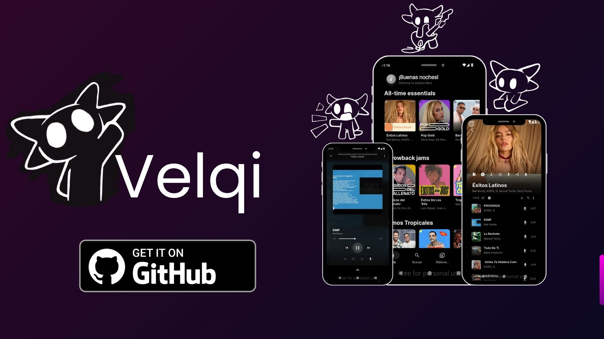

# Velqi

<div align="center">

[](https://github.com/lupyther/Velqi-Music-App/releases/latest)
[](https://www.gnu.org/licenses/gpl-3.0)
[](https://github.com/lupyther/Velqi-Music-App/releases/latest)

[**Descargar**](#descarga) · [**Funciones**](#funciones) · [**Solución de problemas**](#solución-de-problemas)

</div>

---

## Español

Velqi es una app de música libre y de código abierto para Android. Reproduce audio directo de YouTube y YouTube Music usando un backend de Python embebido — sin cuentas, sin anuncios, sin rastreo.

### Funciones

- **Sin anuncios** — Nunca, jamás.
- **Sin cuenta requerida** — Abre la app y empieza a escuchar.
- **Caché inteligente** — Las canciones se cachean al reproducir para una reproducción fluida.
- **Descarga offline** — Guarda canciones en tu dispositivo y escúchalas sin internet.
- **Letras sincronizadas** — Letras animadas palabra por palabra (vía LRCLIB) y modo texto plano.
- **Radio / Cola** — Colas de radio automáticas desde cualquier canción, álbum o artista.
- **Reproducción en segundo plano** — Controles completos en la notificación y pantalla de bloqueo.
- **Temporizador de sueño** — Detiene la reproducción después de un tiempo.
- **Gestión de biblioteca** — Crea playlists, guarda artistas y álbumes.
- **Importar desde YouTube** — Comparte un link de YouTube o YouTube Music directamente a Velqi.
- **Control de calidad** — Elige tu bitrate de streaming preferido.
- **Cookies de YouTube** — Usa tus propias cookies para contenido restringido por región.

### Traducciones

Velqi está disponible en **50 idiomas**. Si quieres ayudar a mejorar o agregar una traducción, edita los archivos en la carpeta [`localization/`](localization/).

| | | | | |
|---|---|---|---|---|
| Árabe | Azerbaiyano | Bengalí | Búlgaro | Birmano |
| Catalán | Checo | Chino (Simplificado) | Chino (Tradicional) | Coreano |
| Croata | Esperanto | Estonio | Euskera | Fiyiano |
| Filipino | Finlandés | Francés | Gallego | Gaélico |
| Alemán | Hindi | Holandés | Húngaro | Indonesio |
| Interlengua | Irlandés | Italiano | Japonés | Kannada |
| Jemer | Kurdo | Malayalam | Noruego | Oriya |
| Persa | Polaco | Portugués | Punjabi | Rumano |
| Ruso | Eslovaco | Serbio | Español | Sueco |
| Tamil | Telugu | Turco | Ucraniano | Urdu |
| Vietnamita | | | | |

### Descarga

<div align="center">

<a href="https://github.com/lupyther/Velqi-Music-App/releases/latest"></a>

</div>

> Si no sabes cuál elegir, descarga `Velqi-1.0.0-arm64-v8a.apk`.

### Solución de problemas

**La reproducción se detiene al apagar la pantalla / después de pocas canciones:**
- Ve a **Ajustes → Optimización de batería** y pon Velqi en **Sin restricciones**, o habilita **Ignorar optimizaciones de batería** desde la app.

**La pantalla de carga dura mucho en el primer arranque:**
- Es normal. El primer inicio inicializa el motor de audio embebido (~15-30 segundos según el dispositivo). Los siguientes arranques son casi instantáneos.

**El contenido no carga / errores de red:**
- Verifica tu conexión a internet.
- Si el contenido de YouTube está restringido por región, agrega tus cookies de YouTube en **Ajustes → Avanzado → Cookies de YouTube**.

### Licencia

```
Velqi es software libre bajo la licencia GNU General Public License v3.0.

Condiciones:
- Las versiones modificadas deben seguir siendo libres y de código abierto.
- No puede publicarse en tiendas de código cerrado (Google Play, App Store, etc.).
- No puede usarse con fines comerciales sin permiso explícito.
```

### Descargo de responsabilidad

Este proyecto es de uso educativo. No tiene afiliación con YouTube ni Google. Todo el contenido al que se accede a través de Velqi pertenece a sus respectivos propietarios.

El software se provee "tal cual", sin garantía de ningún tipo.

---

## English

Velqi is a free, open-source music streaming app for Android. It streams audio directly from YouTube and YouTube Music using an embedded Python backend — no accounts, no ads, no tracking.

### Features

- **Ad-free streaming** — No interruptions, ever.
- **No login required** — Open the app and start listening immediately.
- **Smart caching** — Songs are cached while playing for smooth, uninterrupted playback.
- **Offline downloads** — Save tracks to your device and listen without internet.
- **Synced lyrics** — Animated, word-by-word synchronized lyrics (via LRCLIB) alongside plain text support.
- **Radio / Queue** — Auto-generated radio queues from any song, album, or artist.
- **Background playback** — Full notification controls and lock screen integration.
- **Sleep timer** — Stops playback after a set time.
- **Playlist & library management** — Create playlists, bookmark artists and albums.
- **Import from YouTube** — Share a YouTube or YouTube Music link directly into Velqi.
- **Streaming quality control** — Choose your preferred audio bitrate.
- **YouTube cookies support** — Use your own cookies for regional or restricted content.

### Translations

Velqi is available in **50 languages**. If you'd like to help improve or add a translation, edit the files in the [`localization/`](localization/) folder.

| | | | | |
|---|---|---|---|---|
| Arabic | Azerbaijani | Bengali | Bulgarian | Burmese |
| Catalan | Chinese (Simplified) | Chinese (Traditional) | Croatian | Czech |
| Dutch | English | Esperanto | Estonian | Basque |
| Fijian | Filipino | Finnish | French | Galician |
| German | Gujarati | Hindi | Hungarian | Indonesian |
| Interlingua | Irish | Italian | Japanese | Kannada |
| Khmer | Korean | Kurdish | Malayalam | Norwegian |
| Odia | Persian | Polish | Portuguese | Punjabi |
| Romanian | Russian | Serbian | Slovak | Spanish |
| Swedish | Tamil | Telugu | Turkish | Ukrainian |
| Urdu | Vietnamese | | | |

### Download

Choose the APK that matches your device architecture:

| Device Type | APK | Size |
|---|---|---|
| Modern phones (2018+) | `Velqi-1.0.0-arm64-v8a.apk` | ~24 MB |
| Older phones | `Velqi-1.0.0-armeabi-v7a.apk` | ~23 MB |
| Emulators (BlueStacks, etc.) | `Velqi-1.0.0-x86_64.apk` | ~25 MB |

<div align="center">

<a href="https://github.com/lupyther/Velqi-Music-App/releases/latest"></a>

</div>

> If you're unsure which APK to pick, download `Velqi-1.0.0-arm64-v8a.apk`.

### Troubleshooting

**Playback stops when screen turns off / after a few songs:**
- Go to **Settings → Battery Optimizations** and set Velqi to **Unrestricted**, or enable **Ignore Battery Optimizations** from within the app.

**App shows loading screen for a long time on first launch:**
- This is normal. The first launch initialises the embedded audio engine (~15–30 seconds depending on device speed). Subsequent launches start immediately.

**Content not loading / network errors:**
- Verify your internet connection.
- If YouTube content is region-restricted, try adding your YouTube cookies via **Settings → Advanced → YouTube Cookies**.

### License

```
Velqi is free software licensed under the GNU General Public License v3.0.

Conditions:
- Modified versions must remain free and open-source.
- Cannot be published on closed-source app stores (e.g., Google Play, App Store).
- Cannot be used for commercial or profitable purposes without explicit permission.
```

### Disclaimer

This project is developed for educational purposes. It is not affiliated with, sponsored by, or endorsed by YouTube, Google, or any other content provider. All media content accessed through this app belongs to its respective rights holders.

The software is provided "as-is", without warranty of any kind.
